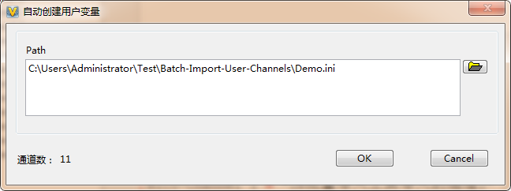
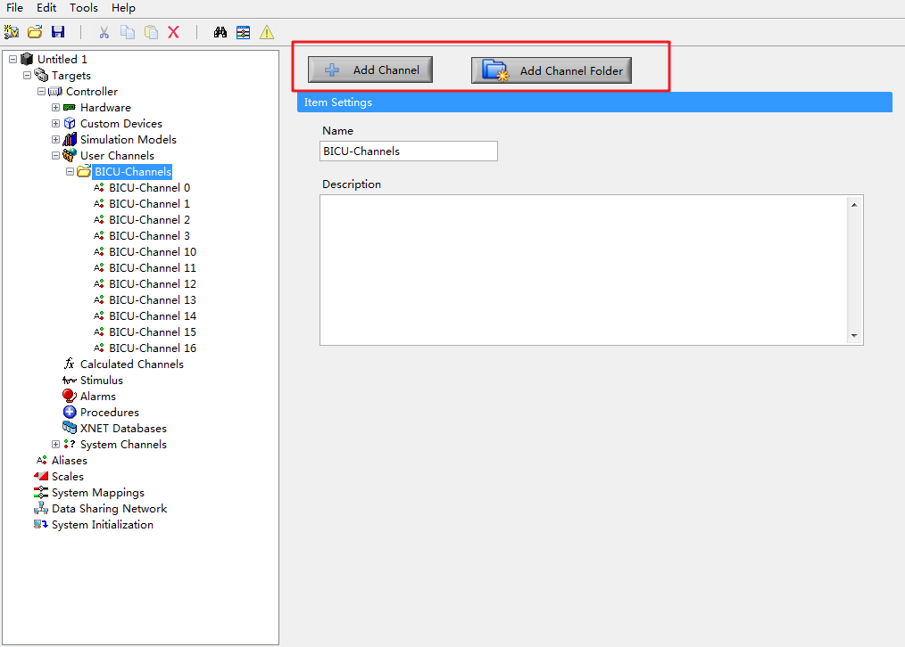
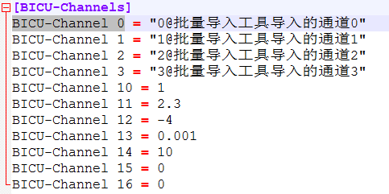
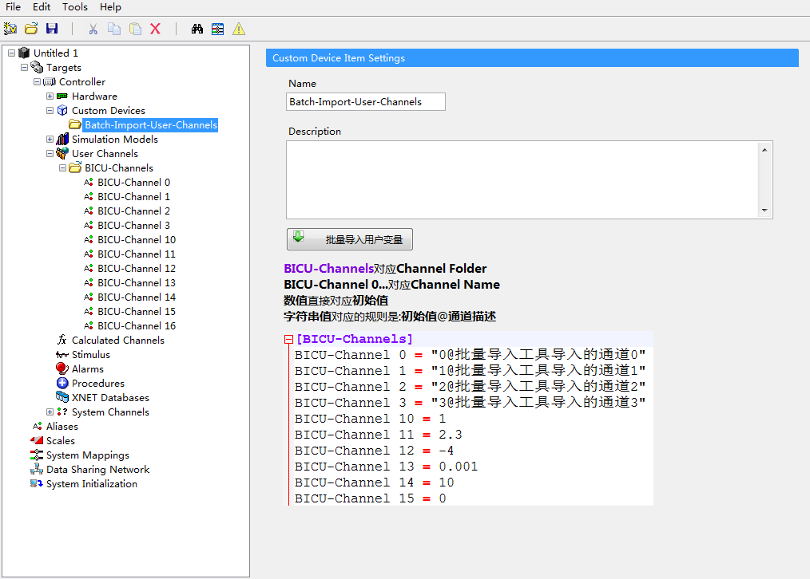

# NI-VeriStand-Batch-Import-User-Channels

在NI VeriStand中通过ini文件批量导入用户变量的工具，通过VeriStand的custom device实现

## 软件版本

LabVIEW 2015

NI VeriStand 2015

## 使用
1.将Bulid中的Batch-Import-User-Channels整个文件夹复制到C:\Users\Public\Documents\National Instruments\NI VeriStand 2015\Custom Devices

2.打开VeriStand，在system definition的Custom Devices中添加Batch-Import-User-Channels

3.在Batch-Import-User-Channels的页面中导入INI文件

4.在Channel Folder之下还可以手动创建通道或者通道文件夹

## ini文件

BICU-Channels对应Channel Folder

BICU-Channel 0...对应Channel Name

数值直接对应初始值

字符串值对应的规则是:初始值@通道描述

## 使用显示

